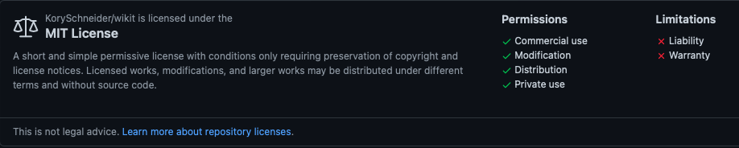
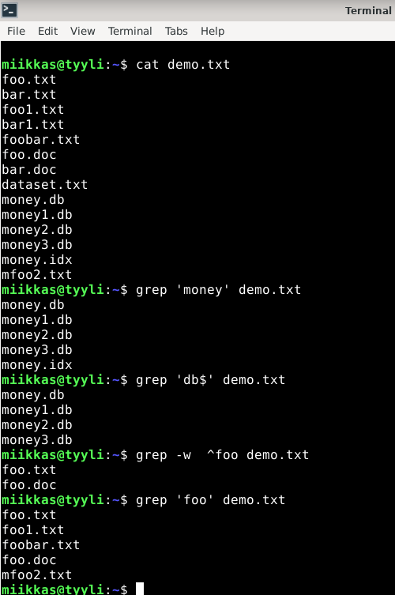

# h3 Tehtävä

## x)

#### FSF Free Software Definition

- Vapaat ohjelmistot ovat ohjelmistoja, jotka kunnioittavat käyttäjien vapautta ja yhteisöllisyyttä. Tämä tarkoittaa, että käyttäjillä on vapaus käyttää, kopioida, jakaa, tutkia, muuttaa ja parantaa ohjelmistoa.
- Ohjelma katsotaan vapaaksi ohjelmistoksi, jos ohjelman käyttäjillä on neljä olennaista vapautta: vapaus ajaa ohjelmaa haluamallaan tavalla, vapaus tutkia ja muuttaa ohjelmaa, vapaus levittää ja kopioita sekä vapaus levittää myös muokattuja versioita. Ohjelmaa ei pidetä vapaana ohjelmistona, jos se ei anna käyttäjille näitä neljää vapautta.
- Jotkut ilmaiset ohjelmistot voivat olla kaupallisia riippuen lisenssistä ja on tärkeää, että ne ovat saatavilla kaupalliseen käyttöön, kaupalliseen kehittämiseen ja kaupalliseen jakeluun.

#### Rise of Open Source: 5 Open Source Licenses as Alternative Governance Mechanisms: 5.1.1 - 5.1.4 (sivu 113 - 121)

- Kirjoituksessa käsitellään avoimen lähdekoodin lisenssien vaatimuksia suhteessa tekijänoikeuslakiin. 
- Tekstissä selitetään, että avoimen lähdekoodin lisenssien on sallittava ohjelmiston kopiointi, jakelu ja muokkaaminen, mikä on ristiriidassa ohjelmistoteollisuuden perinteisen ajattelun kanssa.
- Tekstissä huomautetaan myös, että avoimen lähdekoodin lisenssit eivät aseta vaatimuksia lisenssien yhteensopivuuksille, takuille tai muodollisuuksille. 
- Tekstissä todetaan myös, että avoimen lähdekoodin lisenssit eivät aseta vaatimuksia patenteille
- Lisäksi tekstissä selvennetään, että avoimen lähdekoodin lisenssit eivät kumoa tekijänoikeuslakia.

## a)

### CMatrix

CMatrix käyttää GPL-3.0-lisenssiä, eli uudempaa GPL-lisenssin versiota.
Löysin ohjelman Linux.fi sivulta(https://www.linux.fi/wiki/CMatrix). Sivulle oli merkitty ohjelman kotisivut, lisenssi sekä linkki Githubiin ohjelman lähdekoodiin. Kävin tarkastamassa vielä Githubista lisenssin.

GNU GPL eli GNU General Public Lisence on vapaa lisenssi. 
GNU GPL:
  - Ohjelmaa saa vapaasti käyttää ja tutkia
  - Ohjelmaa saa jakaa edelleen, kunhan lähdekoodi ja lisenssi annetaan mukaan.
  - Ohjelmaan saa tehdä muutoksia ja levittää muutoksien kanssa eteenpäin, mutta muutoksista pitää ilmoittaa selvästi ja jakaa lähdekoodi sekä GPL lisenssi         mukaan.
  - Ohjelmasta saa ottaa osia ja käyttää muissa ohjelmissa, jotka käyttävät GPL-lisenssin samaa versiota. Tekijät täytyy muistaa mainita asianmukaisesti. Monessa ohjelmassa ilmeisesti annetaan käyttäjän valita, että mitä GPL versiota käytetään.
  
 ### Figlet 
 
 Figlet käyttää BSD 3-Clause lisenssiä.
 Löysin figletin kotisivut Linux.fi sivulta. Figletin kotisivuilta(www.figlet.org) löysin linkin figletin Githubiin. Githubissa lisenssiksi oli merkitty BSD 3-lisenssi.
 
 
 
BSD 3-Clause lisenssi on vapaa lisenssi.

BSD 3-Clause versio sallii rajoittamattoman uudelleenjakelun mihin tahansa tarkoitukseen, kunhan sen tekijänoikeusilmoitukset ja lisenssin takuuehdot säilyvät. Lisenssi sisältää myös lausekkeen, joka rajoittaa avustajien nimien käyttöä johdetun teoksen tukemiseen ilman erityistä lupaa.

Tutustui vielä BSD 3-Clause lisenssin ehtoihin hieman tarkemmin, sillä lisenssi oli itselle uusi tuttavuus. Suomensin alle lisenssin ehdot.
 
BSD 3-Clause lisenssin uudelleenjakelu ja käyttö lähde- ja binäärimuodoissa muutoksineen tai ilman niitä on sallittua, jos seuraavat ehdot täyttyvät:

    Copyright <YEAR> <COPYRIGHT HOLDER>

1. Lähdekoodin uudelleenjakelussa on säilytettävä yllä oleva tekijänoikeusilmoitus, tämä ehtoluettelo ja seuraava vastuuvapauslauseke.

2. Binäärimuodossa tapahtuvissa edelleenjakeluissa on esitettävä yllä oleva tekijänoikeusilmoitus, tämä ehtojen luettelo ja seuraava vastuuvapauslauseke dokumentaatiossa ja/tai muussa jakelun mukana toimitetussa materiaalissa.

3. Tekijänoikeuden haltijan nimeä tai sen avustajien nimiä ei saa käyttää tästä ohjelmistosta johdettujen tuotteiden tukemiseen tai mainostamiseen ilman erityistä kirjallista lupaa.(Open Source Initiative)

### Wikit

Wikit käyttää MIT lisenssiä.
Löysin lisenssin tiedot Wikit:n Githubista, johon ohjelman lisenssiksi oli merkitty MIT lisenssi.

MIT lisenssi on vapaa lisenssi. 

MIT lisenssi antaa käyttäjälle oikeudet vapaasti muokata, kopioida ja käyttää teosta omassa projektissa sillä ehdolla, että lisenssin teksti säilyy lähdekoodissa. MIT lisenssi ei vaadi lähdekoodin julkistamista, vaikka muokattua teosta levitettäisiin eteenpäin.

## b)

Tein tekstitiedoston, johon listasin useita erilaisia tiedostojen nimiä.

#### Esimerkki 1.

Avasin tekstitiedoston komennolla 

    $ cat demo.txt
    
Tämän jälkeen rajasin siitä ``$ grep 'money' demo.txt`` komennolla money sanan sisältävät rivit.

Komennolla ``$ grep 'db$' demo.txt`` rajasin tiedostosta rivit, jotka päättyivät 'db'. Käytin ``$`` merkkiä määrittelemään, että kyseisten 'db' merkkien täytyy olla lopussa.

Testasin vielä lisää syöttämällä komennon ``$ grep -w ^foo demo.txt`` komento antoi rivit, jotka alkoivat 'foo' sanalla. ``-w`` rajasi, että haku sisältää pelkästään 'foo' sanan ja ``^`` määritteli, että rivin täytyy alkaa 'foo' sanalla.
Testasin vielä sen jälkeen samaa komentoa ilman ``-w`` ja pelkällä 'foo' sanalla, esimerkissä näkyy miten vastaus eroaa edellisestä tuloksesta.

##### Tulos:

#### Esimerkki 2

Rajasin toisessa esimerkissä samasta demo.txt tiedostosta rivit, jotka alkavat sanoilla 'foo' tai 'bar'. Lisäämällä grep komentoon ``-E`` pystyin hakemaan kahta sanaa samassa komennossa ja ``^`` merkillä määrittelemään, että rivin täytyy alkaa kyseisellä sanalla.

##### Komento:

    $ grep -E '^foo|bar)' demo.txt

##### Tulos:

c)
#### Esimerkki putkista

- Esimerkissä avasin ensin tekstitiedoston ``$ cat demo.txt``, jotta näin mitä haluan rajata.
 
- Aloitin rajaamalla pelkät .txt päätteen sisältävät rivit komennolla ``$ grep '..txt' demo.txt``
 
- Sen jälkeen jatkoin rajaamalla kyseisistä riveistä rivit, jotka sisältivät numeroita komennolla: ``$ grep '..text' demo.txt | grep -v [0-9]`` grep -v rajoittaa rivit, joissa on numero pois hausta.

- Lopuksi lisäsin loppuun ``| sort -r``. Tämä järjestää rivit käänteiseen järjestykseen.

##### Screenshot komennoista ja vastauksista:

## Lähteet
FSF Free Software Definition, Luettavissa: https://www.gnu.org/philosophy/free-sw.html

Välimäki 2005: Rise of Open Source: 5 Open Source Licenses as Alternative Governance Mechanisms: 5.1.1 - 5.1.4 (sivu 113 - 121)

Open Source Initiative, Luettavissa:https://opensource.org/licenses/BSD-3-Clause
